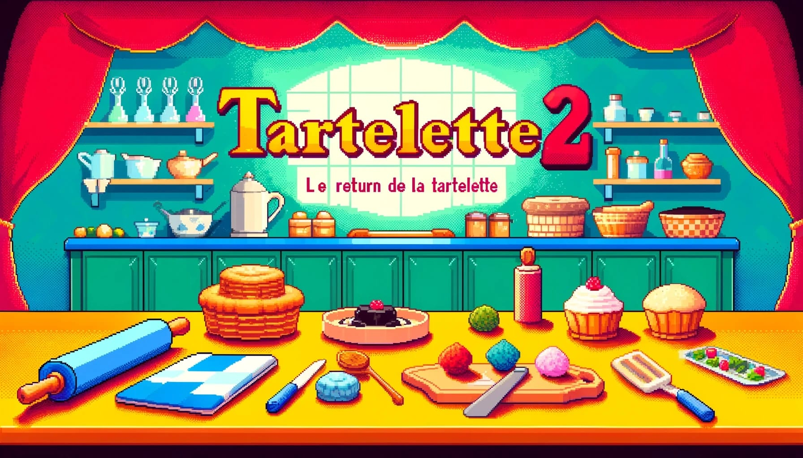
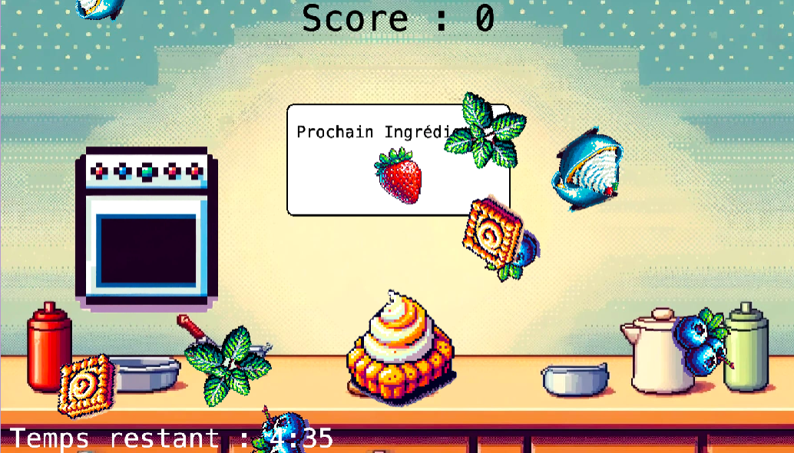

# Tartelette 2: Le Retour de la Tartelette

Bienvenue dans **Tartelette 2: Le Retour de la Tartelette**, un jeu passionnant où vous devez préparer des tartelettes délicieuses dans la boulangerie **Chez David**. Plongez dans l'univers sucré de la pâtisserie et devenez le meilleur chef pâtissier !

## Description du Jeu

Dans **Tartelette 2: Le Retour de la Tartelette**, votre objectif est de préparer des tartelettes parfaites en suivant les recettes et en utilisant les bons ingrédients dans le bon ordre. Les ingrédients apparaîtront à l'écran de manière aléatoire, et vous devrez les cliquer dans l'ordre indiqué pour ajouter chaque ingrédient à votre tartelette.

### Gameplay

Le gameplay se déroule dans la cuisine de **Chez David**, où les ingrédients volent à travers l'écran dans un style "Fruit Ninja". Cliquez sur les ingrédients dans le bon ordre pour les ajouter à votre recette. Si vous vous trompez, la recette sera gâchée et vous devrez recommencer. Préparez-vous à tester vos compétences et vos reflexes !

### Ingrédients et Séquence

Voici les ingrédients que vous utiliserez pour préparer vos tartelettes :

1. **Pâte Brisée**
2. **Crème Pâtissière**
3. **Fraises**
4. **Myrtilles**
5. **Four** (pour cuire la tartelette si jamais)
6. **Crème Chantilly**
7. **Feuilles de Menthe**

### Objectifs

- Préparez autant de tartelettes que possible sans faire d'erreur.
- Améliorez votre vitesse et votre précision pour devenir le meilleur chef pâtissier chez **Chez David**.

## À Propos de Chez David

**Chez David** est une boulangerie renommée connue pour ses délicieuses tartelettes et autres pâtisseries. Avec **Tartelette 2: Le Retour de la Tartelette**, vous avez la chance de travailler dans cette boulangerie de renom et de montrer vos compétences en pâtisserie. 
